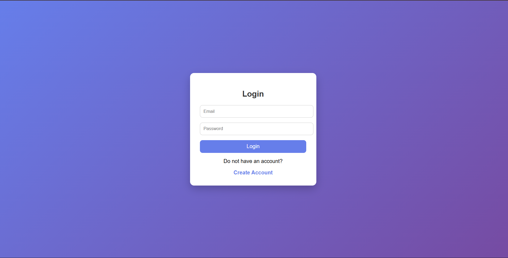
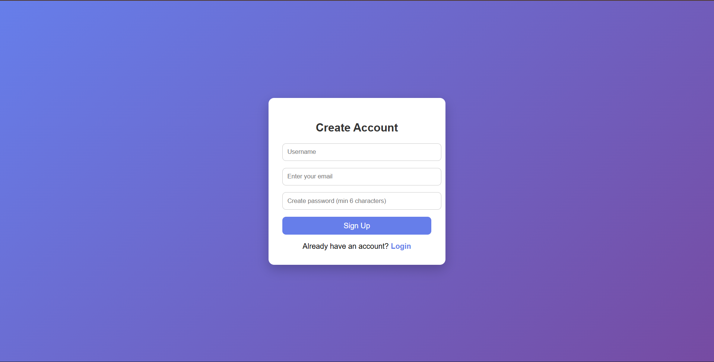
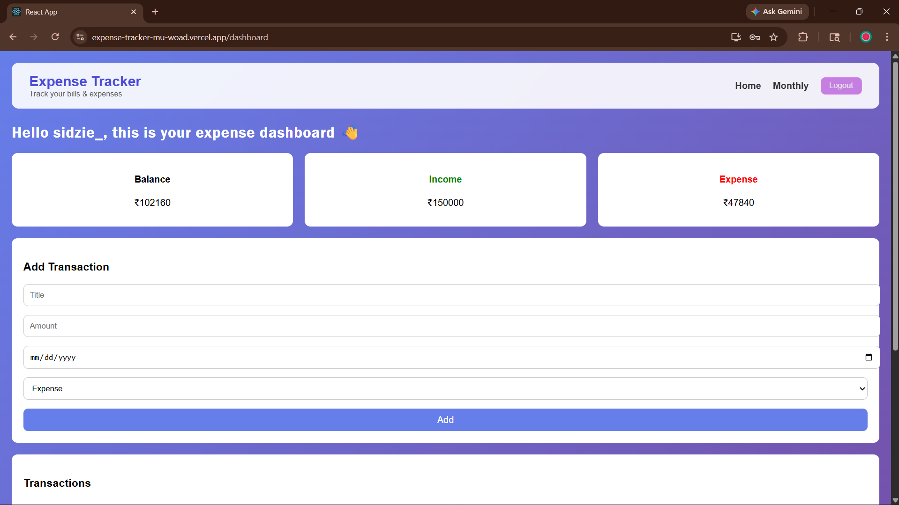
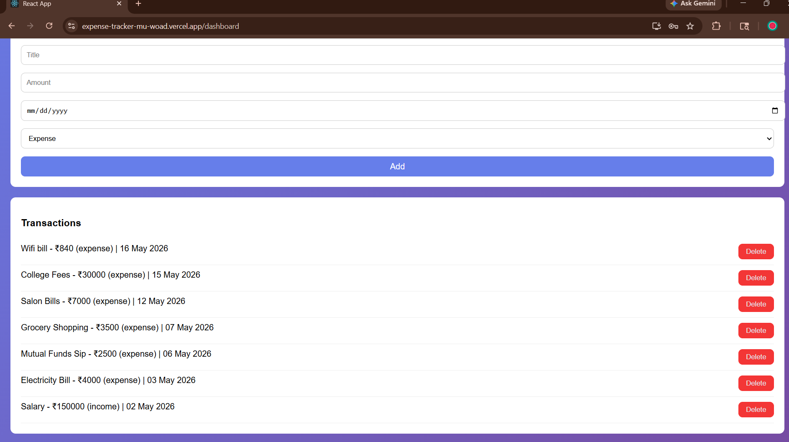
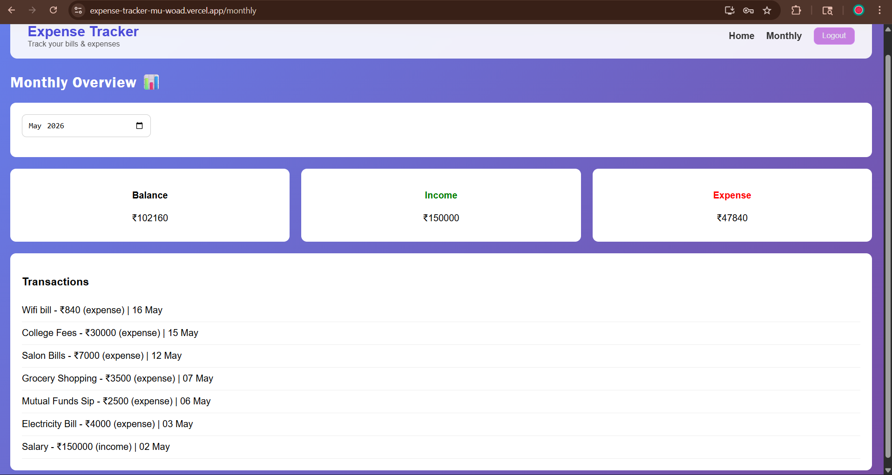

## 💸 Expense Tracker

A full-stack expense tracking application designed to help users manage personal finances efficiently through secure authentication and real-time data tracking.
Here users can sign up, log in, and manage their income and expenses. Built with a React frontend and a Flask REST API backend, secured with JWT authentication
and bcrypt password hashing.

🔗 **Live Demo:** https://expense-tracker-mu-woad.vercel.app

### Login 
### Sign Up 
### Dashboard  
###Transaction List 
### Monthly Overview 

## ✨ Features 
- 🔐 User authentication — Signup and Login with JWT tokens 
- 🔒 Passwords hashed with bcrypt — never stored in plain text
- 💰 Add income and expense transactions
- 🗑️ Delete transactions
- 📊 Live balance, income, and expense summary
- 📅 Monthly overview — filter transactions by month and year
- 🌐 Fully deployed — backend on Railway, frontend on Vercel

## 🛠️ Tech Stack
  
  **Frontend**
  - React.js (Create React App)
  - React Router DOM - CSS
  **Backend**
    - Python / Flask
    - Flask-CORS
    - PyMySQL
    - bcrypt
    - PyJWT
    **Database**
    - MySQL (hosted on Railway)
    **Deployment**
    - Backend → [Railway](https://railway.app)
    - Frontend → [Vercel](https://vercel.com)
      
## 🚀 Getting Started Locally 
### Prerequisites
- Python 3.x
- Node.js
- MySQL database (or Railway MySQL)

## 🔐 Security
- Passwords are hashed using **bcrypt** before being stored in the database
- Authentication is handled via **JWT tokens** with 24-hour expiry
- All expense routes are protected — users can only access their own data
- Parameterized SQL queries prevent SQL injection

## 🧠 Architecture Overview

- Frontend (React) communicates with Flask backend via REST APIs
- Backend handles authentication, business logic, and database operations
- JWT tokens are used for secure session management
- MySQL database stores user and transaction data
- Deployed using Railway (backend + DB) and Vercel (frontend)

## ⚠️ Limitations

- No password reset functionality
- No email verification
- Token storage in localStorage (can be improved with httpOnly cookies)
- Basic UI — can be enhanced for better UX

## 🚀 Future Improvements

- Add charts/analytics (e.g., monthly graphs)
- Implement role-based access
- Add recurring transactions
- Improve security with refresh tokens
- Deploy using Docker

## 🧪 Demo Credentials

Email: test@gmail.com  
Password: 123456
